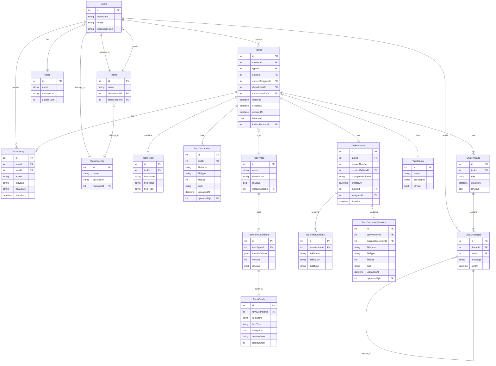

# Feladatmenedzsment és Folyamat Automatizációs Rendszer

## Áttekintés

Ez a rendszer egy feladatmenedzsment és folyamat-automatizációs megoldás, ahol a feladatokat dinamikusan betöltött űrlapok tartalmazzák. Az űrlapok JSON fájlokból töltődnek be. A rendszer támogatja a felhasználó- és csoportkezelést.

## Technológiai Stack

- **Frontend:** Angular
- **Backend:** ASP.NET Core
- **Adatbázis:** SQL
- **Jogosultságkezelés:** .NET Identity

## Főbb Funkciók

- **Folyamatkezelés**: Feladatok végigvitele státuszok szerint.
- **Szűrés és keresés**: Feladatok azonosító, típus, dátum vagy kulcsszó alapján történő keresése.
- **Jóváhagyás és visszaküldés**: Feladatok visszautasítása vagy jóváhagyása a következő státuszba.
- **Konkurens munkavégzés kezelése**: Egy feladat szerkesztése alatt más felhasználók csak olvasási jogot kapnak.
- **Dokumentumkezelés** (idő függvényében):
  - Dokumentumtípusok és mérethatárok meghatározása.
  - Duplikált fájlfeltöltés megakadályozása.
- **Üzenetküldés**:
  - Valós idejű chat vagy frissítés a feladat beadásakor.
  - Push értesítés az érintett felek számára új üzenet érkezésekor.
- **Hírek és frissítések**: Ikon a legújabb funkciók, szabályváltozások és verziófrissítések megjelenítésére.
- **Dark és Light mód**: Váltási lehetőség a megjelenés között.
- **Automatikus validáció**: A felhasználó csak akkor küldheti be az űrlapot, ha minden kötelező mezőt kitöltött.
- **Mentési opciók**:
  - **Mentés és bezárás**: Feladat piszkozatként mentése.
  - **Mentés bezárás nélkül**: Munkamenet elhagyásával az adatok törlődnek.
  - **Automatikus mentés**: Hosszabb munkavégzés során időközönként mentés az adatbázisba.
- **Döntési státuszok kezelése**: A feladatok aktuális állapota és következő lépéseinek meghatározása.
- **Feladat delegálás**: A következő terület megfelelő kollégájára automatikusan átruházható a feladat.
- **Jogosultságkezelés**:
  - A felhasználók magukhoz vehetik vagy leadhatják a feladatokat.
  - Magasabb rangú felhasználók másokra delegálhatják a feladatokat.
  - Hierarchikus szerepkörök (pl. csoportvezető, területvezető).
- **Feladat paraméterezés**:
  - Státuszok és átmenetek meghatározása.
  - Jogosultsági szintek kezelése.
  - Határidők beállítása.
- **Verziókezelés és naplózás**: Minden módosítás rögzítésre kerül.
- **Email értesítések**: Határidő közeledtével és státuszváltás esetén.

## Nézetek

### 1. Taskpool

A fő nézet, ahol a felhasználó:

- Megtekintheti a saját és területi feladatait.
- Feladatot indíthat.
- Elérheti a különböző feladatnézeteket.

### 2. Feladatindítás

A felhasználó kiválaszthatja az elindítandó feladatokat:

- **Kedvencek fül**: Gyakran használt feladatok elérése.
- **Kereső**: Feladatok könnyebb megtalálása.

### 3. Kereső

A felhasználó azonosító, feladattípus, dátum vagy kulcsszó alapján kereshet.

### 4. Feladatnézet

- A felhasználó láthatja a saját és a területei feladatait.
- Csak a saját területeihez tartozó feladatokat érheti el.
- A feladatok határidő szerint rendezve jelennek meg.

### 5. Feladat űrlap

- **Fő adatok**: Feladat típusa, azonosítója, státusza.
- **Űrlap kitöltése**: A dinamikus mezők megjelenítése.
- **Dokumentumkezelés**: Dokumentumok feltöltése, típuskategorizálással.
- **Chat ablak**: Feladat alapú üzenetküldés.
- **Információs fül**: Feladat részletei, státuszok, határidők.
- **Összegzés**: Következő lépések, határidők, felelős terület megjelenítése.

## Felhasználói Szerepek

- **Bejelentkezés szükséges**: Csak regisztrált felhasználók férhetnek hozzá.
- **Szerepkörök**:
  - **Admin**: Rendszerszintű beállítások kezelése.
  - **Maintenance**: Technikai támogatás.
  - **Standard felhasználók**: Csak a saját területükhöz tartozó feladatokat érhetik el.
  - **Csoportvezető/Területvezető**: Jogosultság más feladatok delegálására.

## UX/UI

- **Reszponzív felület**: Minden eszközön optimális megjelenítés.
- **Drag and Drop támogatás**: Egyszerűbb feladatkezelés.
- **Egységes dizájn**: Nincs személyre szabható kinézet.

## JSON Példa – Űrlap Meghatározása

```json
{
  "fields": [
    {
      "name": "firstName",
      "label": "First Name",
      "type": "text",
      "value": "",
      "placeholder": "Elek",
      "validators": {
        "required": true
      },
      "columnClass": "col-md-6",
      "tooltip": "Enter your first name"
    },
    {
      "name": "lastName",
      "label": "Last Name",
      "type": "text",
      "value": "",
      "placeholder": "Teszt",
      "validators": {
        "required": true
      },
      "columnClass": "col-md-6",
      "tooltip": "Enter your last name"
    }
  ]
}
```

Ez a dokumentum strukturált és könnyen olvasható módon összegzi a rendszer funkcionalitását és felépítését.

## Adatbázis Séma

A rendszer az alábbi adatbázis struktúrát használja a funkciók megvalósításához:

### Fő Entitások

#### Felhasználókezelés
- **Users**: Felhasználói adatok és hitelesítés
- **Roles**: Jogosultsági szintek és szerepkörök
- **Teams**: Csapatok kezelése
- **Departments**: Szervezeti egységek

#### Feladatkezelés
- **Tasks**: Alap feladat információk
- **TaskTypes**: Feladattípusok definíciói
- **TaskStatus**: Státuszok kezelése
- **TaskFields**: Dinamikus űrlapmezők értékei

#### Verziókezelés
- **TaskVersions**: Feladatok verziótörténete
- **TaskFieldVersions**: Mezőértékek verziói
- **TaskDocumentVersions**: Dokumentumok verziói

#### Kommunikáció
- **ChatThreads**: Beszélgetés szálak
- **ChatMessages**: Üzenetek
- **ChatMessageAttachments**: Csatolt fájlok
- **ChatMessageReadStatus**: Olvasási státuszok

### Adatbázis Diagram




## Felhasználók és Jogosultságok

### Users 
- **Cél**: A rendszer felhasználóit tárolja.
- **Kapcsolatok**:
  - Felhasználók hozzáadhatnak feladatokat (Tasks).
  - Felhasználók küldhetnek üzeneteket (ChatMessages).
  - Felhasználók jogosultságokkal rendelkeznek (Roles).
  - Felhasználók osztályokhoz tartoznak (Departments) és csapatokat vezethetnek (Teams).

### Roles 
- **Cél**: A rendszerben elérhető jogosultsági szintek kezelése.
- **Kapcsolatok**: Minden felhasználónak van egy hozzárendelt szerepe.

## Feladatkezelés

### Tasks 
- **Cél**: A rendszerben kezelendő feladatokat tárolja.
- **Kapcsolatok**:
  - Egy feladatnak lehet létrehozója (Users).
  - Feladatokhoz dokumentumok (TaskDocuments) és mezők (TaskFields) tartozhatnak.
  - Egy adott feladathoz kapcsolódhat csevegés (ChatThreads).
  - A feladatoknak lehet verzókövetése (TaskVersions) és története (TaskHistory).

### TaskTypes 
- **Cél**: A feladatok típusait határozza meg.

### TaskStatus 
- **Cél**: A feladatok aktuális állapotát tárolja.

### TaskVersions 
- **Cél**: A feladatok verzókövetését biztosítja.
- **Kapcsolatok**:
  - Egy feladathoz több verzó is tartozhat.

### TaskHistory 
- **Cél**: A feladatok múltbeli változásait naplózza.

### TaskFields 
- **Cél**: A feladatokhoz tartozó egyedi mezőket tárolja.

### TaskDocuments 
- **Cél**: A feladatokhoz csatolt dokumentumokat tárolja.

## Csevegés és Kommunikáció

### ChatThreads 
- **Cél**: A feladatokhoz kapcsolódó csevegéseket kezelik.

### ChatMessages 
- **Cél**: A rendszerben lévő csevegés üzeneteit tárolja.
- **Kapcsolatok**:
  - Felhasználók küldhetik ezeket az üzeneteket.

### ChatMessageAttachments
- **Cél**: Az üzenetekhez csatolt fájlokat kezeli.

## Egyéb Entitások

### Departments
- **Cél**: A szervezet különböző osztályait tárolja.

### Teams
- **Cél**: A szervezeten belüli csapatokat kezeli.

### TaskFormDefinitions
- **Cél**: A feladatok űrlapstruktúráját határozza meg.

### FormFields
- **Cél**: Az űrlapokhoz tartozó mezőket tárolja.

---
Ez a dokumentáció bemutatja a rendszer adatbázisának felépítését és a főbb táblák szerepét.


